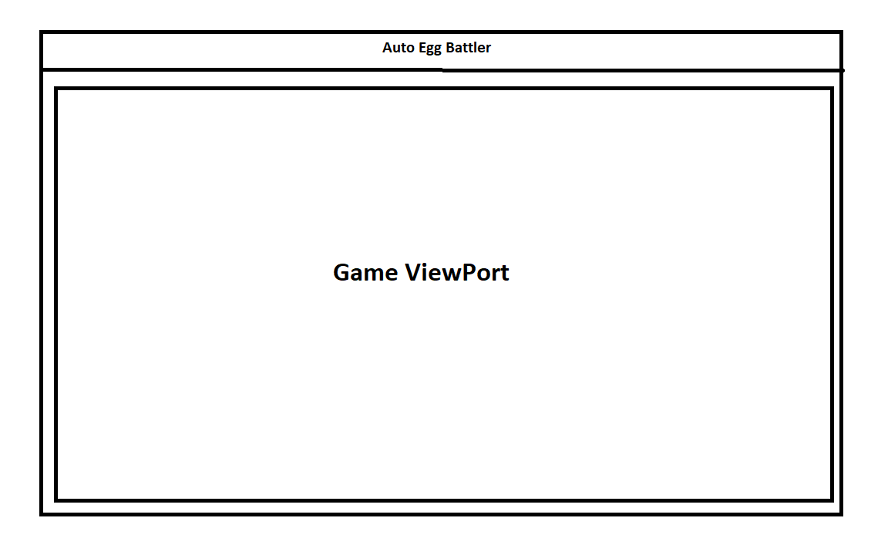
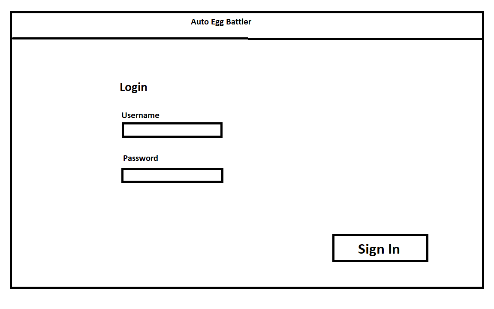
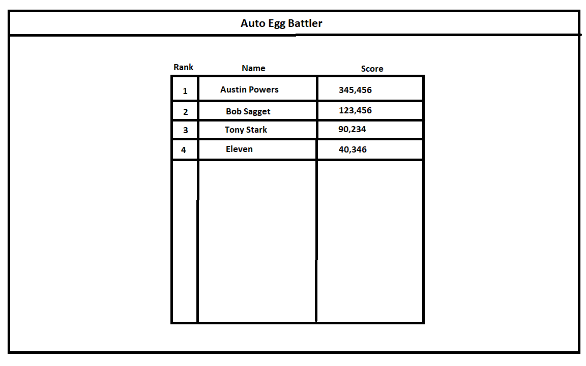

# [Chicken and the Egg ^3] Design Document

## Auto Egg Battler Design

## 1. Problem Statement
We are trying to design a game using the auto battler format.

## 2. Top Questions to Resolve in Review
1. Deterministic logic for battles.   
2. Character movement.   
3. Stats Format for characters and what stats to include.
4. Setup For AI, then setup multiplayer
5. API calls backend.

## 3. Use Cases

U1. As an Auto Egg Battler player, I want to acquire characters and items when I
purchase them from the store.

U2. As an Auto Egg Battler player, I want to be able to place my characters on the board, 
and to move them from one place on the board to another.
    
U3. As an Auto Egg Battler player, I want to be able to place items on my characters.

u4. As an Auto Egg Battler player, I want to be able to run the battle simulation when I am ready.

U5. As an Auto Egg Battler player, I want to be able to sell items and characters in the store.
(possible trade system)

U6. As an Auto Egg Battler player, I want to be able to win the game or quit when I don't.

## 4. Project Scope

*Clarify which parts of the problem you intend to solve. It helps reviewers know
what questions to ask to make sure you are solving for what you say and stops
discussions from getting sidetracked by aspects you do not intend to handle in
your design.*

### 4.1. In Scope

*Which parts of the problem defined in Sections 1 and 2 will you solve with this
design?*
1. Single player 
2. Buy and sell Characters and items.
3. Move Characters and assign items.
4. Start battles.
5. Default enemy teams with different levels of difficulty.
6. Character statistics.
7. Item statistics.
8. client retrieval of data for battles.
9. saving team compositions levels.

### 4.2. Out of Scope

*Based on your problem description in Sections 1 and 2, are there any aspects
you are not planning to solve? Do potential expansions or related problems occur
to you that you want to explicitly say you are not worrying about now? Feel free
to put anything here that you think your team can't accomplish in the unit, but
would love to do with more time.*

1. multiplayer.
2. trading items and characters.
3. player health pool.
4. persistent battles.
5. character animations.
6. character assets.
7. player login.
8. ranking system.
9. battle pass.
10. skins for boards and player.

# 5. Proposed Architecture Overview

1. Deterministic logic for battles:  
To remove any chances or percentage calculation in the simulation of the battle 
2. Character movement.  
Turn based system that is based of the initiative stat of the units on the board with a simple path find algorithm 
3. Stats Format for characters and what stats to include.  
Initial launch we are using Attack damage, Defensive armor, and Health. later we will add magic system and other statistics for units
4. Setup For AI, then setup multiplayer  
AI system will be built into the unit logic and other for single player we will just use default board layouts.
5. API calls backend.  
Using AWS cloudformation, DynamoDB, S3 Bucket, API Gateway, and Lambda functions.
6. Frontend.  
Using Node.js, Axios, and React.

# 6. API

## 6.1. Public Models

UnitModel 
&nbsp;&nbsp;String name; 
&nbsp;&nbsp;int health; 
&nbsp;&nbsp;int defence; 
&nbsp;&nbsp;int attackDamage; 

CurrentUnitModel 
&nbsp;&nbsp;String unitID; 
&nbsp;&nbsp;String name; 
&nbsp;&nbsp;String boardLocation; 
&nbsp;&nbsp;int maxHealth; 
&nbsp;&nbsp;int maxDefence; 
&nbsp;&nbsp;int maxAttackDamage; 
&nbsp;&nbsp;List `<ItemName>` itemIDs;
    
ItemModel 
&nbsp;&nbsp;String name; 
&nbsp;&nbsp;int healthMod; 
&nbsp;&nbsp;int defenceMod; 
&nbsp;&nbsp;int attackDamageMod; 

BoardModel 
&nbsp;&nbsp;String boardID; 
&nbsp;&nbsp;List`<CurrentUnitIDs>`units;

## 6.2 Post StartGame EndPoint
* Accepts Post request to /StartGame
* Accepts Board Model

## 6.3 Get ItemData EndPoint
* Accepts Get Request to /ItemData
* Return List of ItemData Models

## 6.4 Get UnitData EndPoint
* Accepts Get Request to /UnitData
* Return List of UnitData Models

## 6.5 Put UpdateBoard EndPoint
* Accept Put Request to /BoardData
* Accepts Board Model 

## 6.6 Put UpdateUnit EndPoint
* Accepts Put Request to /UnitData
* Accepts Unit Model

# 7. Tables

*Define the DynamoDB tables you will need for the data your service will use. It
may be helpful to first think of what objects your service will need, then
translate that to a table structure, like with the *`Playlist` POJO* versus the
`playlists` table in the Unit 3 project.*

Units 
&nbsp;&nbsp;String name; 
&nbsp;&nbsp;int health; 
&nbsp;&nbsp;int defence; 
&nbsp;&nbsp;int attackDamage; 

CurrentUnits 
&nbsp;&nbsp;String unitID; 
&nbsp;&nbsp;String name; 
&nbsp;&nbsp;String boardLocation; 
&nbsp;&nbsp;int maxHealth; 
&nbsp;&nbsp;int maxDefence; 
&nbsp;&nbsp;int maxAttackDamage; 
&nbsp;&nbsp;List `<ItemName>` itemIDs;

Items 
&nbsp;&nbsp;String name; 
&nbsp;&nbsp;int healthMod; 
&nbsp;&nbsp;int defenceMod; 
&nbsp;&nbsp;int attackDamageMod; 

Boards 
&nbsp;&nbsp;String boardID; 
&nbsp;&nbsp;List`<CurrentUnitIDs>`units;

# 8. Pages

*Include mock-ups of the web pages you expect to build. These can be as
sophisticated as mockups/wireframes using drawing software, or as simple as
hand-drawn pictures that represent the key customer-facing components of the
pages. It should be clear what the interactions will be on the page, especially
where customers enter and submit data. You may want to accompany the mockups
with some description of behaviors of the page (e.g. “When customer submits the
submit-dog-photo button, the customer is sent to the doggie detail page”)*

1. Main Game Page

2. Login Page ( Phase II )

3. Leader Board ( Phase II )

